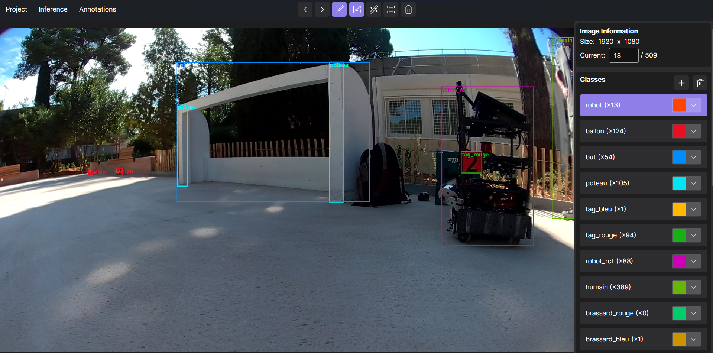

## YALA Yet Another Labelling App

### This app allows you to add square bounding boxes around object, and much more:
- Auto detection on image/project by providing a YOLO v8+ ONNX model
- Bounding box resizing
- Mouse pan and zoom
- Annotations import and export for YOLO
- Project split (for collaboration)
- Project merge
- And much more...

